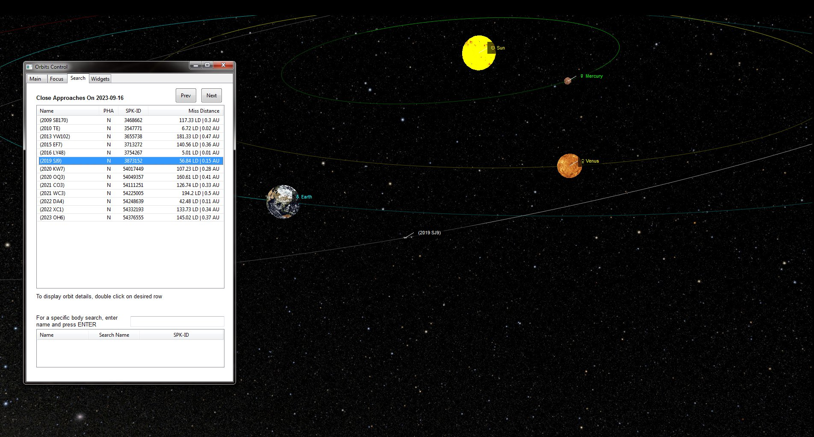
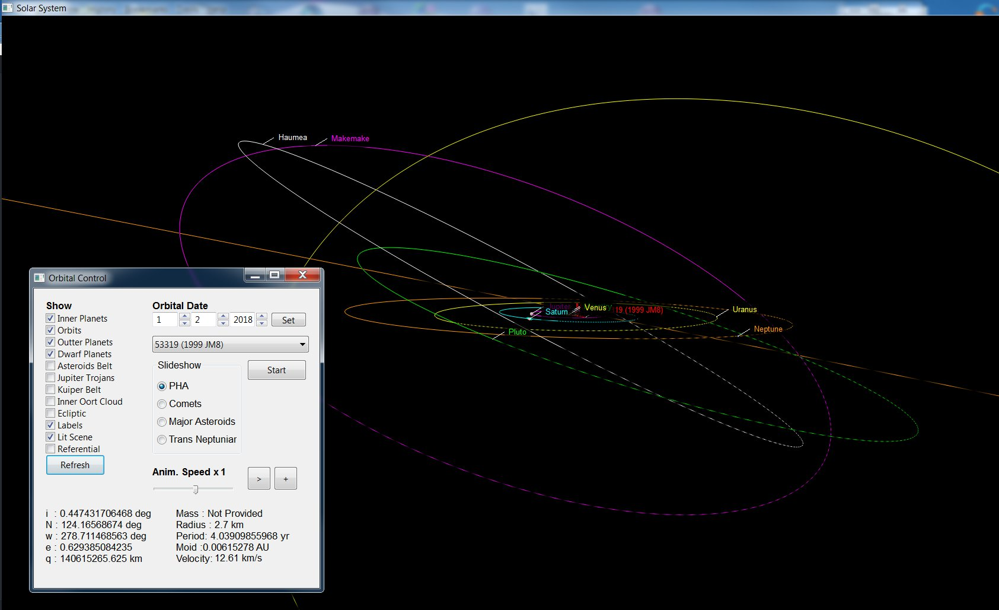

# Orbital

"Orbital" is an accurate interactive 3D representation of the solar system featuring inner and outer planets, asteroids, comets and Trans-Neptunian objects. It also includes the asteroid belt, Jupiter Trojans, Kuiper belt and inner Oort cloud.

The 3D orbits of major objects in the solar system are rendered and can be zoomed in and out as well as rotated. Each object is located on its actual orbit position at the time of rendering. For a demo of the simulation go to https://youtu.be/WjiwySvZY3g

# Interacting with the simulation:

To zoom in/out: click on both mouse buttons and drag the mouse forward or backward.
To rotate the scene: click on the mouse left button only and drag the mouse sideways.

The data was collected from the JPL Small-Body Database Search Engine and the Nasa planetary factsheets. The Celestial mechanic concepts required to develop this program can be found in the Roger Bates's book "Introduction to Astrodynamics", as well as the document "Keplerian Elements for Approximate Positions of the Major Planets" (E.M. Standish from JPL Caltech).

Keep in mind that

	- All distances between each object and the sun are proportional to the actual distance.
	- Objects sizes are NOT proportional to their actual size (this is by design in order to 
	  view all objects properly).
	- Asteroid belt, Kuiper belt, Jupiter Trojans and Oort Cloud are included for illustration purpose only. 
	  Even though their size and thickness is somehow proportional to their actual dimension, the distribution 
	  pattern within the belt is purely random/aesthetic.
	
# Platform:

	python 2.7.9
	vpython 6
	wxpython 3.0

you will also need the following libraries:

	numpy
	scipy

To launch the application, go to the folder where the project was downloaded and type:

	> python2.7.exe solarsys.py
	
The vpython display window and the Orbital control modal window will take only a few seconds to load. PHA, Asteroids, Comets and trans-Neptunian objects orbits get calculated and rendered as needed, but inner and outter planets orbits are displayed right away and can be interacted with. The constant MAX_OBJECTS in solarsys.py specifies the upper limit of objects to load per data file.

Once the Orbital Control modal pops up, you may visualize the other major bodies in the solar system: dwarf planets, Asteroid, Kuiper belts etc... All PHAs, Major Asteroids, Comets and Trans-Neptunian objects orbits can be displayed with the slideshow feature. You may pause at any time to take a closer look at trajectories by zooming in/out and rotate, and then resume. You may also animate the current object from the slideshow along with other visible objects by using the ">" play button. You may also do it frame by frame using the "+" button. The animation minimum increment is 10 minutes between frames. 

Animations can be played at increased or decreased speed between - x24 to + x24, allowing to go back in time as well as in the future. The time increment may vary from 10 minutes to 240 minutes (4 hours) between frames. Specific dates can also be entered directly to examin orbits relative positions. This is an interesting feature to verify passed or future events, such as close encounters between earth and PHAs (ie, Asteroid Toutatis on December 12, 2012 -or- Asteroid Midas on March 21st 2018). Remember that planets, comets or asteroids sizes are not realistic (they are much bigger than their actual size), so even though objects may look sometime very close to each other, the actual distance that separate them is much larger. A good way to figure that out is to look at the Earth MOID parameter that displays the closest distance between the object's orbit and the earth's orbit. To have a better idea of how close objects are from each other, use the checkbox "Adjust objects size" which will render a size a closer to reality.

You may also pick individual objects from the drop down box to display and animate their trajectories on orbit. When an animation or a slideshow is in progress, the drop down box is disabled and picking an object from it will have no effect. A slideshow must be fully stopped (not just paused) to enabled the drop down box again.

The current object orbital elements are displayed at the bottom of the Orbital Control dialog. 
Legend is:

	i: Orbital Inclinaison
	N: Longitude of Ascending node
	w: Argument of Perihelion
	e: Orbit Eccentricity
	q: Perihelion distance to the sun

	M: Mass in kg
	R: Average radius in Km
	P: Orbital Period in years

	Moid: Minimum Orbital Intersection Distance (in this case with Earth) in Astronomical Units (AU)
	Velocity: The current velocity on orbit (this will be updated during animation) in kilometers/sec

# POV:

You have the ability to change the reference POV to any object of your choice. By default, the POV is focused on the Sun, but it can be set on any of the major inner / outer planets, the dwarf planets - or - on the body that you are currently studying.

# Files:

	solarsys.py: 	Main file
	orbital.py:  	Orbits trajectory and belts calculations classes
	controls.py:	Orbital controller class used in the "Orbital Control" user interface
	planetsdata.py:	Orbital elements for major planets and belts
	numberfmt: 	String precision formatting
	
# Close Approach Data:

"Orbital" allows you to find out which asteroids "close encounters" are happening with earth on a daily basis. If you click on the "Close Approach Data" tab, you will be able to directly fetch from the JPL database the list of objects that are at their closest position to earth for the current day. 

	
Once the list has been downloaded, you may also get the list from the previous or the next day. Double clicking on a row in that list will automatically display the orbit and position of the corresponding object, as well as switch back to the "Main" tab to detail its orbital elements.

Note: The autoscale feature in vpython is a bit erratic. If you are in a very expansive view that includes far objects such as dwarf planets and also closer to the sun objects like inner planets, unchecking the far objects and refreshing the scene may "autoscale" you back inside the sun (even though everything looks black). To eliminate the problem, simply perform a zoom out.

The planets and the sun rotate on their axis in a realistic way, according to their rotation rate. You may note that Venus and Pluto seem to have a retrograde motion and that's because their north pole is reversed. A good way to clarify what is happening is to check the "Show Local Referential" checkbox in the"Animation POV" tab. Also note the great range of rotation rate among the planets, from really fast (the outter planets) to really slow (Venus).

List of a few close encounters between Potentially Harzardous Asteroids and earth:

	YU55	 	11/08/2011
	TOUTATIS 	12/12/2012
	MIDAS    	03/21/2018
	2004 XK50 	12/24/2025
	

# How to install the platform on Windows computer:

	1) Install python2.7 64 bits:
	go to "https://www.python.org/downloads/release/python-279/" and under "Files", 
	click on "Windows x86-64 MSI installer". Download the installer and run it.

	use the default install configuration. Your python folder should be 
	in c:\python27

	If you get the error "error: Microsoft Visual C++ 9.0 is required. Get it from http://aka.ms/vcpython27" 
	then from "https://www.microsoft.com/en-us/download/confirmation.aspx?id=44266" download the VC runtime
	installer: VCForPython27.msi and run it to install the missing runtime library. Then try to run the python27
	installer again to finish installing python. 
	
	Add "c:\python27" and "c:\python27\scripts" to your PATH environment variable
 
	2) Install Numpy and Scipy libraries:
	go to http://www.lfd.uci.edu/~gohlke/pythonlibs
	- download numpy+mkl: "numpy-1.13.1+mkl-cp27-cp27m-win_amd64.whl"
	- download scipy: "scipy-0.19.1-cp27-cp27m-win_amd64.whl"

	3) In order to have a smooth library install, first make sure the program "pip.exe" is up to date. 
	"pip.exe" is under c:\python27\Scripts. From the command prompt type:

	"python -m pip install --upgrade pip"

	4) then install the modules you previously downloaded using the pip program:

	pip install -U numpy-1.13.1+mkl-cp27-cp27m-win_amd64.whl
	pip install -U scipy-0.19.1-cp27-cp27m-win_amd64.whl

	if you get a message "<wheelname> is not a supported wheel on this platform", despite the
	fact that you already updated pip, it means you probably downloaded the wrong library for this
	version of python. Make sure the library is the correct one.
	
	5) Install vPython:
	go to http://vpython.org/contents/download_windows.html
	and download the installer: "VPython-Win-64-Py2.7-6.11"

	Once downloaded, run it. This installer will also install the wxPython 3.0 library.
	That's it!

Enjoy the simulation!

